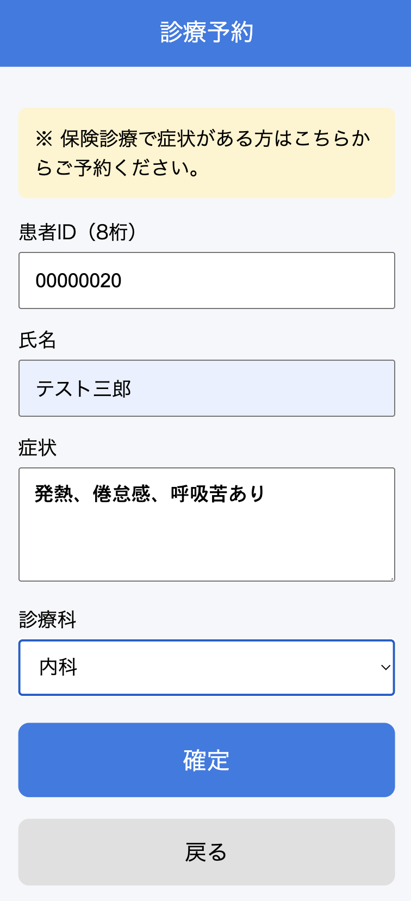
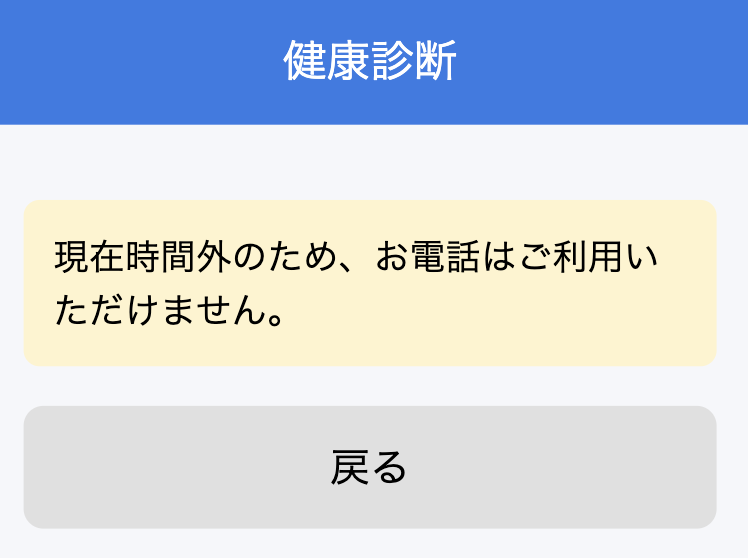
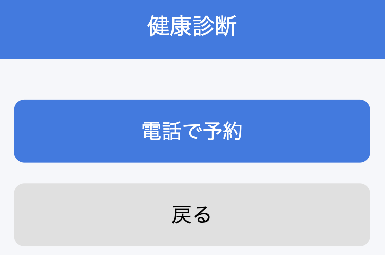
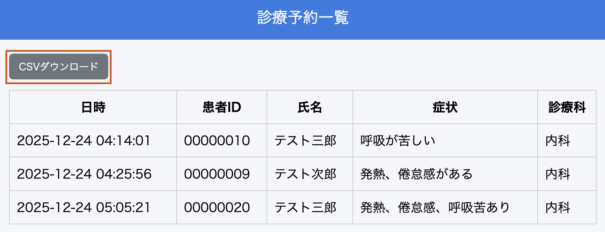

# 病院予約システム（PHP / XAMPP）

## 1.制作物の説明

PHP + ファイル保存で作成した簡易病院予約システム。

### 予約トップ（患者側）

### 診療予約画面（患者側）

### 健康診断画面（患者側）

  
  

※時間内外で電話可否を分岐

### 管理画面(病院側)

## 2.工夫した点・こだわった点

- 講義で習った排他制御を実装できたこと。
- csv ダウンロードできるようにしたこと。

## 3.次回トライしたこと（または機能）

- Open AI の API を使用して、症状を入力したら、対象の診療科が出てくるようにしたい。
